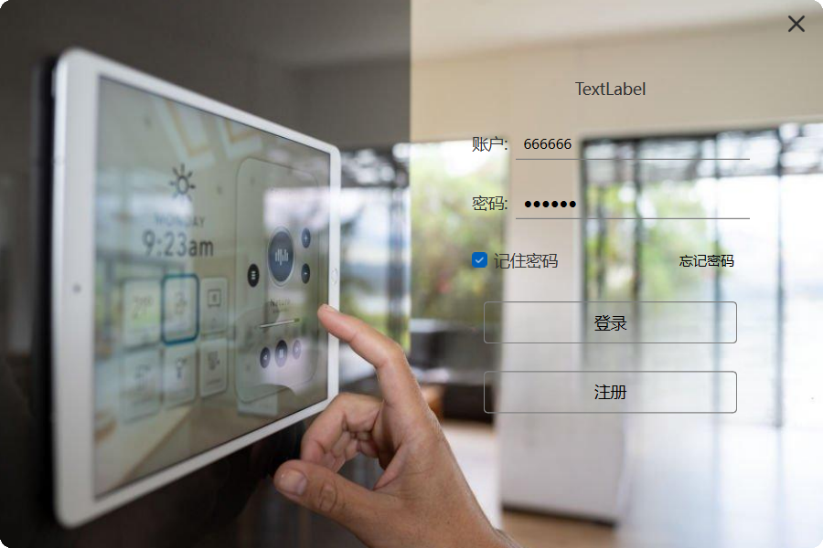
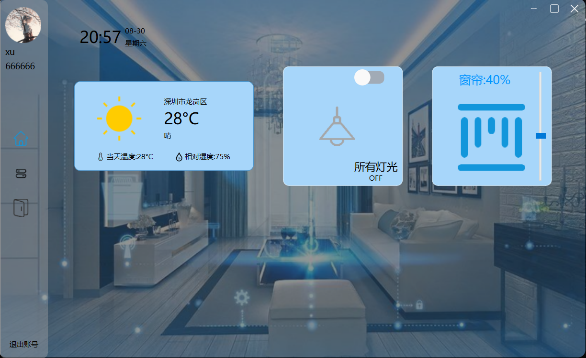
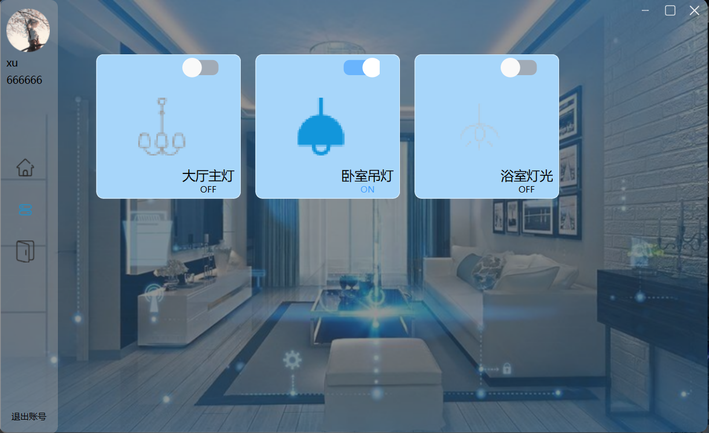

# Qt-SmartHome
基于qt和stm32的智能家居中控系统
本项目构建了一套完整的物联网控制系统，由Qt跨平台客户端作为控制中枢、自定义服务端处理用户认证及数据管理、云端EMQX Cloud作为通信枢纽、STM32+ESP8266硬件终端作为执行单元组成的四层架构体系，通过MQTT/HTTP协议实现远程实时设备控制、用户认证管理及多端数据协同交互。

使用qt界面客户端并且自定义服务端连接数据库，通过http访问服务端数据和外部api,qt客户端直连mqtt broker和硬件进行数据交换，硬件由stm32f103c8t6作开发板，esp8266做wifi模块连接mqtt broker

登录界面

主页界面

设备控制界面

